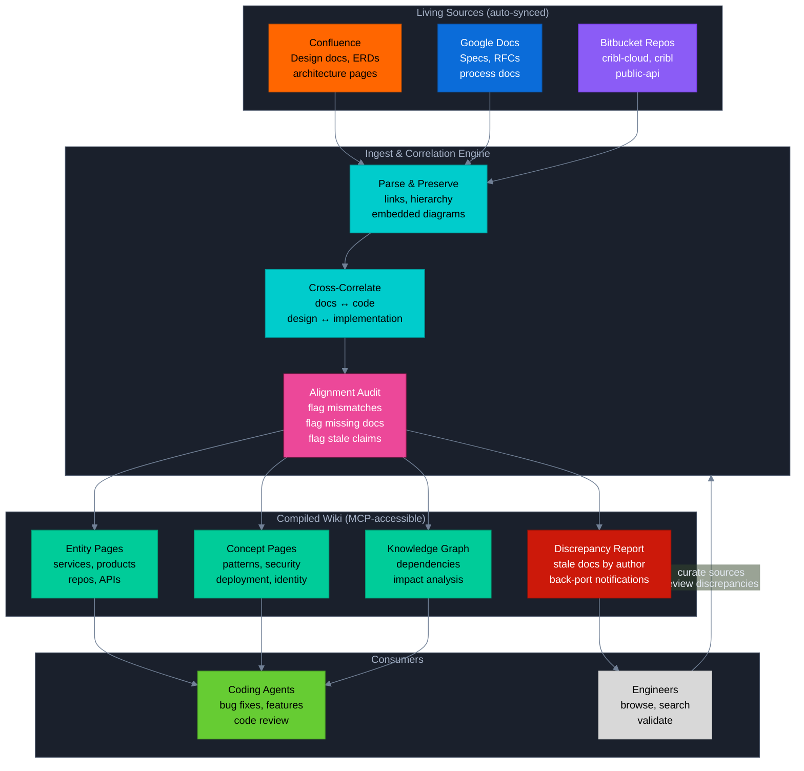
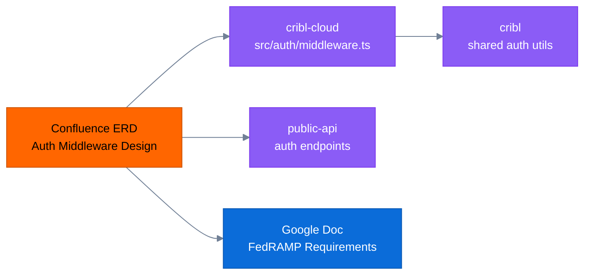

# Cribl Knowledge Wiki

An agent-first knowledge platform that continuously ingests Confluence, Google Docs, and Bitbucket repositories, then compiles a structured wiki that any coding agent can use to understand how Cribl's systems work, what depends on what, and what will break when something changes.

## The Problem

Engineering knowledge at Cribl is scattered across hundreds of Confluence pages, Google Docs, and dozens of Bitbucket repositories. No single person — and no single agent — can hold the full picture.

When an agent works on a bug fix in `cribl-cloud`, it has no idea that the function it's changing is described in a Confluence ERD, depended on by `public-api`, and subject to FedRAMP compliance requirements documented in a Google Doc. It operates with a myopic view of one repo, producing changes that are locally correct but globally naive.

**The wiki fixes this.** It compiles, cross-references, and maintains a living knowledge graph that any agent can query before writing a single line of code.

## How It Works



### Source Integrations

All sources are **living documents** — continuously synced, never uploaded once and forgotten.

| Source | What's Indexed | How It Connects |
|--------|---------------|-----------------|
| **Confluence** | Pages with full hierarchy, embedded images, draw.io diagrams, child pages. Auto-sync detects updates via version polling. | Links between Confluence pages are preserved. Each page's author and last-modified date are tracked for back-port notifications. |
| **Google Docs** | Shared documents with formatting, comments, embedded content. | Cross-referenced with Confluence design docs covering the same topics. |
| **Bitbucket** | Multiple repos (`cribl-cloud`, `cribl`, `public-api`, etc.). Source trees, READMEs, config files, package structures, key interfaces. | Code is mapped to the design docs that describe it. Wiki pages link to specific files and line numbers in Bitbucket. |

No file uploads. No PDFs. No one-shot documents. If it's not a living, versioned source that can be re-synced, it doesn't belong here.

---

## What the Wiki Produces

### 1. Entity & Concept Pages

Every service, product, repo, and cross-cutting theme gets a wiki page with:
- Architecture diagrams (Mermaid, branded with Cribl colors)
- Attribute tables
- Inline citations linking back to the exact source document
- Links to implementing source code in Bitbucket
- Cross-references to related wiki pages

### 2. Knowledge Graph

The wiki tracks connections between documents and code:



When an agent asks "what does the auth middleware depend on?", the wiki doesn't just return prose — it returns the design doc, the implementing files across three repos, the compliance requirements, and the downstream services that would be affected by a change.

### 3. Alignment Audit

The correlation engine continuously surveys docs and code for alignment:

| Check | What It Finds | Action |
|-------|--------------|--------|
| **Design ↔ Implementation** | ERD says auth uses JWT validation, but code uses session cookies | Flags mismatch on both the wiki page and the source doc view |
| **Stale Documentation** | Confluence page last updated 2023, but the code it describes was rewritten in 2025 | Flags for author notification |
| **Missing Documentation** | 5,000 lines of billing logic in `cribl-cloud/src/billing/` with zero Confluence coverage | Recommends new ERD creation, assigns to team lead |
| **Contradictions** | Two Confluence pages make conflicting claims about the same service | Surfaces both claims side-by-side with links |

### 4. Discrepancy Report & Back-Port Notifications

A dedicated wiki page — `/wiki/discrepancies.md` — tracks every flagged issue:

```markdown
## Auth Middleware — Design/Implementation Mismatch
- **Confluence**: ERD AuthN/Z Speedup in Maestro.html (author: @jsmith, last updated: 2024-03-15)
- **Code**: cribl-cloud/src/auth/middleware.ts (last commit: 2025-11-02)
- **Issue**: ERD describes JWT-only validation, code now uses hybrid JWT + session approach
- **Action**: @jsmith — please update the ERD to reflect the hybrid approach
- **Impact**: 3 downstream wiki pages reference the outdated design

## Billing Pipeline — Missing Documentation
- **Code**: cribl-cloud/src/billing/ (47 files, 5,200 lines, no Confluence coverage)
- **Team**: Platform / Billing
- **Action**: Create new ERD covering billing data flow, Metronome integration, and credit pool logic
```

Authors are notified when their documents are flagged. The report is the feedback loop that keeps Confluence honest — the wiki doesn't just consume docs, it holds them accountable.

---

## Who Consumes the Wiki

### Primary: Coding Agents

The wiki is built for agents, not humans. Every page is structured so an MCP-connected agent can:

**Translate design requirements into implementation:**
> "I need to implement the new workspace suspension feature. What does the ERD say? Which services are involved? Show me the existing code for workspace lifecycle in cribl-cloud and the API contract in public-api."

The agent gets the design doc, the implementing files, the dependency graph, and the test patterns — all in one query. It writes code that respects the full system, not just the file it's editing.

**Fix bugs with full context:**
> "Users report auth tokens aren't refreshing. What's the designed token refresh flow? Which repos implement it? Are there known issues flagged in the alignment audit?"

The agent gets the sequence diagram from the design doc, the implementing code across Auth0/Maestro/Zeus, and any flagged mismatches between design and implementation.

**Review code with system awareness:**
> "This PR changes the billing webhook handler. What downstream services consume these events? Does this change align with the FinOps ERD? Are there compliance requirements I should check?"

The agent reviews with knowledge of the full dependency graph, not just the diff.

### Secondary: Engineers

Engineers get a browsable, human-readable wiki as a side benefit of the markdown format. They can:
- Browse the wiki tree in the web UI
- Click through diagrams and cross-references
- View source documents with flagged discrepancies highlighted
- Track which Confluence pages need updates via the discrepancy report

---

## Architecture

The platform ships an **MCP server** that any Claude-based agent can connect to. The agent gets tools to search, read, write, and delete across the knowledge vault.

| Component | Stack | Role |
|-----------|-------|------|
| **API** | FastAPI, asyncpg | Source import (Confluence, Google Docs, Bitbucket), document worker, auto-sync |
| **MCP Server** | MCP SDK, Supabase OAuth | Agent-facing tools: `guide`, `search`, `read`, `write`, `delete` |
| **Web** | Next.js 16, React 19, Tailwind | Human-readable wiki browser, source viewer, discrepancy dashboard |
| **Database** | Postgres (Supabase) + PGroonga | Documents, chunks, knowledge graph edges, discrepancy tracking |
| **Worker** | DB-backed queue, FOR UPDATE SKIP LOCKED | Processes pending imports, re-syncs updated sources |

### MCP Tools

| Tool | Description |
|------|-------------|
| `guide` | Returns the full wiki generation guide — structure, diagrams, colors, citations. Any agent reads this first. |
| `search` | Browse files or keyword search with PGroonga ranking. Scoped by path, tags, or source type. |
| `read` | Read documents — Confluence HTML, source code, wiki pages. Batch reads via glob patterns. |
| `write` | Create wiki pages, edit with `str_replace`, append. Mermaid diagrams, tables, citations. |
| `delete` | Archive documents by path or glob pattern. |

---

## Cribl Systems Coverage

| Domain | Components | Sources |
|--------|-----------|---------|
| **Cribl.Cloud** | Zeus, Maestro, Auth0, Billing, Admin App | Confluence ENG space, `cribl-cloud` repo |
| **Products** | Stream, Edge, Search, Lake | Product-specific Confluence spaces, `cribl` repo |
| **Platform** | Typhon, CI/CD, Monitoring, Entitlements | Confluence ERDs, `cribl-cloud` infra code |
| **Public API** | REST API, Terraform Provider, SDKs | OpenAPI specs, `public-api` repo |
| **Security** | Auth, RBAC, FedRAMP, ISO compliance | Confluence + Google Docs policy documents |

---

## Why This Works

Every engineering organization has the same problem: knowledge is scattered, stale, and disconnected. Confluence pages describe a system that was refactored six months ago. Design docs reference code that's been moved. New services get built with zero documentation because writing docs is thankless work.

The wiki doesn't ask anyone to write more docs. It reads what already exists — Confluence pages, Google Docs, source code — and compiles a cross-referenced knowledge graph that stays current because the sources are synced, not uploaded.

The real value isn't the wiki itself. It's what happens when every coding agent in the organization has access to it:

- **Fewer regressions** — agents see the dependency graph before making changes
- **Better implementations** — agents follow the design docs instead of guessing
- **Honest documentation** — the discrepancy report forces stale Confluence pages to get updated
- **System-wide awareness** — no more myopic single-repo changes that break downstream consumers

The human's job is to curate sources, direct the analysis, and review the discrepancy report. The LLM's job is everything else.

## License

Apache 2.0
