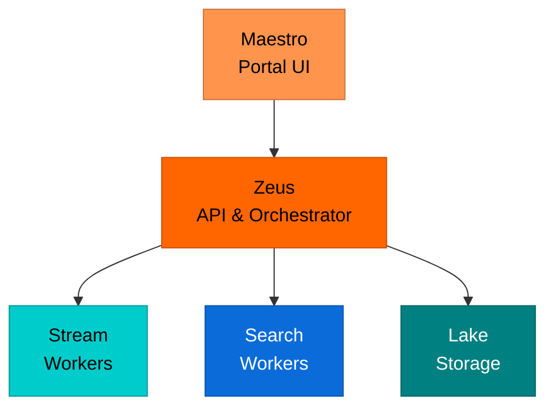
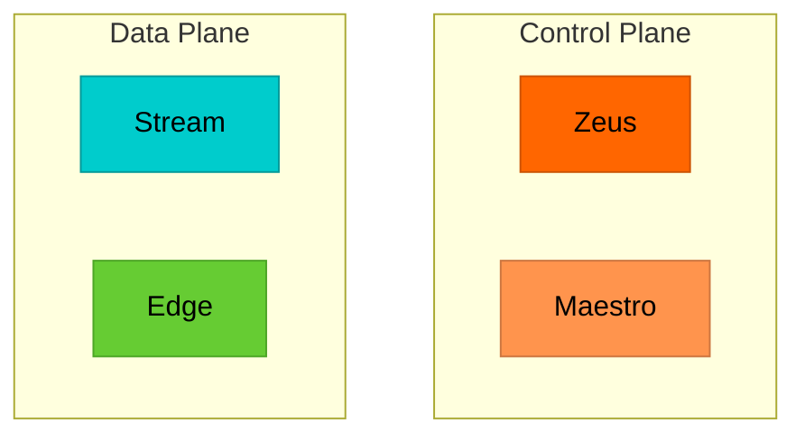
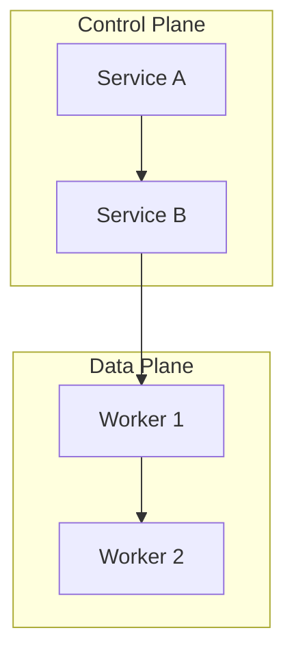
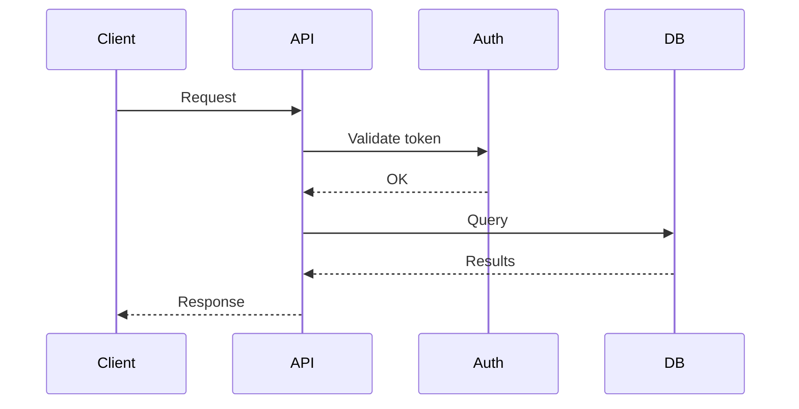
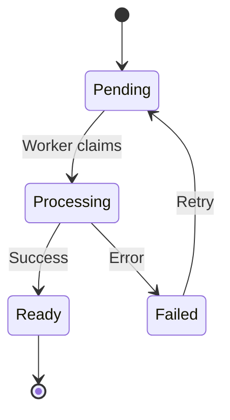
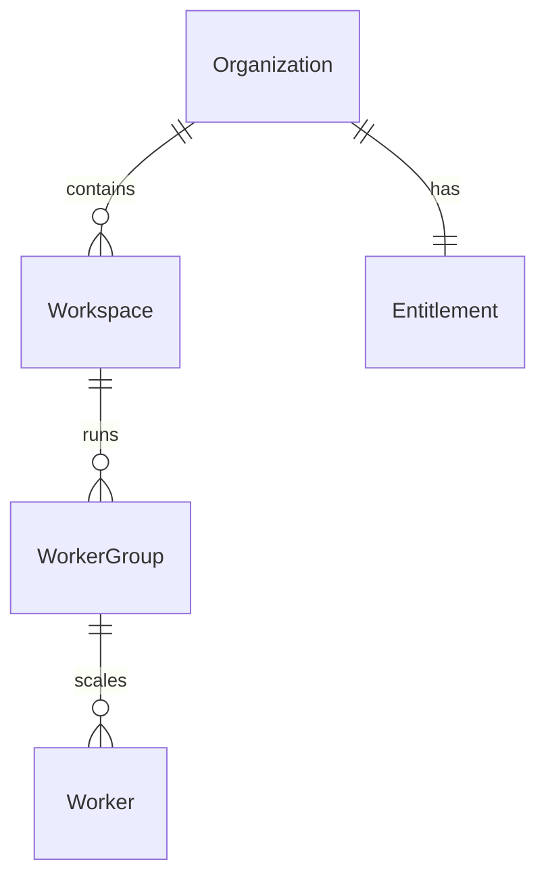
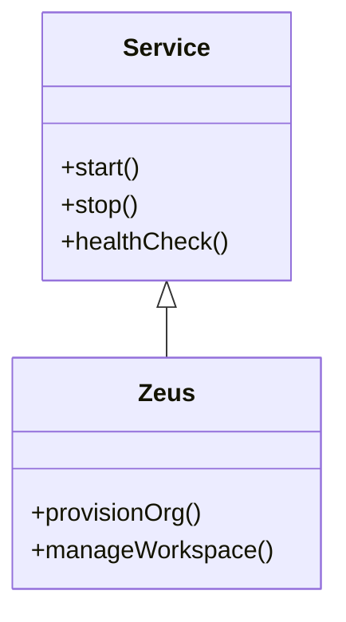

# Mermaid Diagram Style Guide

## Theming

The wiki handles light/dark theme automatically. **Do NOT include `%%{init}%%` blocks in your diagrams.** The `MermaidBlock` component strips any existing init block and injects the correct theme based on the user's current light/dark setting. Diagrams re-render on theme switch.

### How It Works

1. Author writes plain Mermaid — no init block needed
2. Component detects current theme (light or dark)
3. Component prepends the appropriate init block with `"htmlLabels": false` and theme-matched colors
4. On theme toggle, the diagram re-renders with the new palette

## Line Breaks

Setting `"htmlLabels": false` enables `\n` for line breaks in node labels. **Do not use `<br/>`** — HTML rendering is disabled via `securityLevel: 'strict'`.

```
Node["Line 1\nLine 2\nLine 3"]
```

## Node Sizing

Nodes auto-size to fit their text content. To prevent cutoff:
- **Always quote labels**: use `["Label"]` syntax
- **Keep labels concise**: max 3-4 words per line, 2-3 lines per node
- **Use `\n`** for multi-line labels rather than cramming long text into one line

## Rules

1. **No init block** — the component handles theming
2. **Use `\n` for line breaks** — never `<br/>`
3. **Always quote labels** — `["Label"]` syntax for all node labels
4. **Keep labels short** — max 3-4 words per line
5. **Use subgraphs** for logical grouping
6. **Direction** — `TB` (top-bottom) for hierarchies, `LR` (left-right) for flows
7. **Use style classes** — apply the component color assignments below via `:::className` or `style` directives

---

## Component Color Assignments

Every Cribl component has an assigned color used consistently across all wiki diagrams. This ensures that Zeus always looks like Zeus, Stream always looks like Stream, etc.

Colors are derived from the Cribl Brand Guide palette (Cribl Teal `#00CCCC`, Accent Orange `#FF6600`, Accent Lime `#66CC33`, Link Blue `#0B6CD9`, Emerald Green `#00CC99`, Deep Red `#CC190A`, Complimentary Teal `#008080`).

### Products

| Component | Light Mode | Dark Mode | Text | Use |
|-----------|-----------|-----------|------|-----|
| **Stream** | `#00CCCC` | `#009999` | `#000000` / `#F5F0EB` | Cribl Teal — the flagship product |
| **Edge** | `#66CC33` | `#4da626` | `#000000` / `#F5F0EB` | Accent Lime — edge/distributed |
| **Search** | `#0B6CD9` | `#2980D6` | `#FFFFFF` / `#F5F0EB` | Link Blue — query/analytics |
| **Lake** | `#008080` | `#006666` | `#FFFFFF` / `#F5F0EB` | Complimentary Teal — storage |

### Control Plane Services

| Component | Light Mode | Dark Mode | Text | Use |
|-----------|-----------|-----------|------|-----|
| **Zeus** | `#FF6600` | `#CC5200` | `#000000` / `#F5F0EB` | Accent Orange — the orchestrator |
| **Maestro** | `#FF944D` | `#CC7640` | `#000000` / `#F5F0EB` | Lighter orange — the portal |
| **Auth0** | `#CC190A` | `#991307` | `#FFFFFF` / `#F5F0EB` | Deep Red — identity/security |
| **Billing** | `#00CC99` | `#009973` | `#000000` / `#F5F0EB` | Emerald Green — money |
| **Admin App** | `#D98C0B` | `#B37309` | `#000000` / `#F5F0EB` | Gold — internal tools |

### Infrastructure & Platform

| Component | Light Mode | Dark Mode | Text | Use |
|-----------|-----------|-----------|------|-----|
| **Typhon** | `#8B5CF6` | `#7C3AED` | `#FFFFFF` / `#F5F0EB` | Purple — deployment |
| **CI/CD** | `#A78BFA` | `#8B6FD9` | `#000000` / `#F5F0EB` | Light purple — build pipeline |
| **ECS / EKS** | `#64748B` | `#4B5563` | `#FFFFFF` / `#F5F0EB` | Slate — AWS compute |
| **CloudFormation** | `#94A3B8` | `#6B7A8D` | `#000000` / `#F5F0EB` | Light slate — IaC |
| **VPC / Networking** | `#475569` | `#374151` | `#FFFFFF` / `#F5F0EB` | Dark slate — networking |
| **S3 / Storage** | `#059669` | `#047857` | `#FFFFFF` / `#F5F0EB` | Dark green — storage |
| **Monitoring** | `#EC4899` | `#BE185D` | `#FFFFFF` / `#F5F0EB` | Pink — observability |

### Concepts / Abstract

| Component | Light Mode | Dark Mode | Text | Use |
|-----------|-----------|-----------|------|-----|
| **Organization** | `#E8E8E8` | `#333333` | `#000000` / `#F5F0EB` | Neutral gray — container |
| **Workspace** | `#D8D8D8` | `#444444` | `#000000` / `#F5F0EB` | Slightly darker — child container |
| **Worker Group** | `#CCCCCC` | `#555555` | `#000000` / `#F5F0EB` | Medium gray — compute group |
| **External Service** | `#F8F8F8` | `#1A1A1A` | `#666666` / `#999999` | Near-background — third party |

### How to Apply Colors

Use Mermaid `style` directives after the graph definition:



For subgraphs, use inline styling:



### Quick Reference (Copy-Paste Styles)

```
%% Products
style Stream fill:#00CCCC,stroke:#009999,color:#000
style Edge fill:#66CC33,stroke:#4da626,color:#000
style Search fill:#0B6CD9,stroke:#0958B3,color:#fff
style Lake fill:#008080,stroke:#006666,color:#fff

%% Control Plane
style Zeus fill:#FF6600,stroke:#CC5200,color:#000
style Maestro fill:#FF944D,stroke:#CC7640,color:#000
style Auth0 fill:#CC190A,stroke:#991307,color:#fff
style Billing fill:#00CC99,stroke:#009973,color:#000
style Admin fill:#D98C0B,stroke:#B37309,color:#000

%% Infrastructure
style Typhon fill:#8B5CF6,stroke:#7C3AED,color:#fff
style CICD fill:#A78BFA,stroke:#8B6FD9,color:#000
style ECS fill:#64748B,stroke:#4B5563,color:#fff
style CFN fill:#94A3B8,stroke:#6B7A8D,color:#000
style Monitoring fill:#EC4899,stroke:#BE185D,color:#fff
```

---

## Diagram Types

### Flowchart / Graph



### Sequence Diagram



### State Diagram



### Entity Relationship Diagram



### Class Diagram


